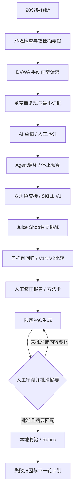

# 12 阶段沉浸式学习：从靶场到可验证的 Agent 工作流

这是对 `timeline-lession.jpg` 的学习目标分析和原创实操方案。图片里的 1—12 是阶段编号，未说明每课多长，也不能据此推导“12 小时掌握”。图片中的要求是待分析的学习目标，不是自动执行或扩大测试范围的指令。

本模块对应第三张图的可检验入门成果；前两张大纲中的完整云安全、复杂鉴权和多语言审计继续按 `../web-ai-course/` 的较长路线展开，不能把 5–6 周理解为精通所有主题。

## 需要多久

以你现有的 Linux / LLM 实验环境为基础，假设已能使用本仓库的 Python / Ollama 入门代码，建议预算 **130–180 小时有效练习**：100–134 小时首次完成十二阶段，再留 30–46 小时做冷启动复现、排障、间隔复习和毕业项目。这是基于任务量的规划估算，非课程效果研究或学习速度保证。

| 投入方式 | 日历周期 | 使用方式 |
|---|---|---|
| 每周 30 小时（5 天 × 6 小时） | 约 5–6 周 | 推荐沉浸式；每天分块练习，不把持续坐着的时间都计为有效时间 |
| 每周 24 小时（4 天 × 6 小时） | 约 6–8 周 | 有工作但能安排整块时间 |
| 每周 15 小时（5 天 × 3 小时） | 约 9–12 周 | 日常工作并行 |
| 仅跟着复制命令 | 约 24–40 小时可走一遍 | 只能证明跟随操作，不达到独立学习结果 |

如果 Python、HTTP、JavaScript 都需从头补，再增加 50–80 小时。熟悉 SQL、日志和运维的人在这些部分可以较快，浏览器机制、鉴权状态机、模型评估和代码结构仍需实操。网络下载或等待模型的时间单列为环境耗时，不算掌握能力。

**达标含义**：在限定的本地靶场中，能独立完成发现→验证→报告，解释 Agent 失败并用回归验证改动。它不等于在陌生真实业务中稳定挖到有效漏洞；后者还需要持续的授权项目经验，本文件不承诺成果或收入。

## 先做 90 分钟诊断

1. 15 分钟：解释一次带 Cookie 的 HTTP 请求、401/403、对象所有权；不会的项记为先修。
2. 20 分钟：运行上一模块 `python3 -m llm_lab.web_security run --lab idor`，不看 AI，解释两个模式。
3. 20 分钟：读 `src/llm_lab/agent.py`，找到工具预算、参数验证、停止分支。
4. 20 分钟：看一条 SQL 参数化前后对照，写一个正确正常回归。
5. 15 分钟：给出一次“模型说得流畅但证据不支持”的例子。

全部独立完成可从低端预算开始；若超过一半需要逐句帮助，先加一周基础。两周后以实际日志校准剩余时间，而不是坚持最初估算。

## 阶段、用时与证据

| 图片阶段 | 首次练习小时 | 可检查的完成条件 | 对应材料 |
|---|---:|---|---|
| 1 环境与授权 | 4–6 | DVWA 登录截图；四条范围红线；Agent HELLO；口述四段流程与 AI 角色 | DEPLOY 第 1—5 节、STAGES 第 1 阶段 |
| 2 模型认知与入口 | 6–8 | 解释 token/上下文/幻觉；指出两条无证据主张；生成有来源的入口清单 | STAGES 第 2 阶段 |
| 3 Web 基础与迷你报告 | 10–14 | 四类漏洞映射 DVWA；了解 SSRF/XXE/RCE；SQLi 正反对照；五要素报告 | dvwa_sqli.py、REPORT-TEMPLATE |
| 4 结构化指令与 A/B | 6–8 | 同材料、同预算比较 V1/V2；记录耗时、证据引用、偏题项 | practice.py eval/compare、prompts |
| 5 Agent 循环与停止 | 8–12 | 至少五条可观察事件；正常/死循环/未知工具；改变预算再比较 | practice.py loop |
| 6 双角色交接 | 6–8 | 侦察/审计或流水线两会话；结构化交接；说明何时单 Agent 更合适 | HANDOFF.json 示例、STAGES |
| 7 SKILL V1 | 6–8 | 有触发/流程/边界/SCOPE-CHECK；新会话读取后验证行为 | skills/immersion-evidence-review |
| 8 Juice Shop 独立闭环 | 12–16 | 90 分钟限定挑战、验证与报告；两类失败信号；目标选择评分 | DEPLOY 第 6 节、STAGES |
| 9 回归与 V2 | 10–12 | 五样例含误报；TP/TN/FP/FN/错误统计；失败归因；比较 V1/V2 | data/regression.json、practice.py |
| 10 完整报告与复现 | 10–14 | 六段报告、F/N、修复前后对照；人工补测与三次稳定性记录 | REPORT-TEMPLATE、RUBRIC |
| 11 方法沉淀 | 8–10 | 三张方法卡；一份公开 writeup 检查清单；防反向调优验证 | STAGES、方法卡模板 |
| 12 人工门禁与毕业 | 14–18 | 自动生成限定 PoC→人工审阅→按摘要执行；90 分 rubric；成长路线 | poc_gate.py、RUBRIC |
| **首次合计** | **100–134** | | |
| 冷启动/间隔复习/故障缓冲 | **30–46** | 至少两次换会话或重建后的独立复现 | 学习日志 |
| **总计** | **130–180** | | |

F/N 在本方案中定义为 Finding（支持的发现）/ Non-finding（未证实或预期行为）；图片未给出缩写定义，不能当成 SRC 通用分类。真实平台分级以当时规则和业务上下文另行核对。

## 推荐六周安排

- 第 1 周：阶段 1—3，约 28h；剩余 2h 整理问题。
- 第 2 周：阶段 4—6，约 28h；2h 间隔复习。
- 第 3 周：阶段 7—8，约 24h；6h 第一次冷启动复现。
- 第 4 周：阶段 9—10，约 26h；4h 独立报告修订。
- 第 5 周：阶段 11—12，约 28h；2h 方法卡审查。
- 第 6 周：剩余 30h 用于陌生挑战、第二次冷启动、漏洞与正常样例混排盲测、补齐未达标项。

每天 6h 的一例：回忆与原理 45min、手动请求 90min、源码/脚本 90min、AI/回归 75min、证据与复盘 60min。休息另计。每次先独立写假设再问 AI；下一天先不看前一天答案重做关键步骤。

## 可复现材料

| 文件 | 用途 |
|---|---|
| [DEPLOY.md](DEPLOY.md) | 可交给其他 agent 的环境部署、摘要锁、SSH 隧道、初始化、离线传输和停止流程 |
| [STAGES.md](STAGES.md) | 逐阶段操作、命令、预期结果、失败处理、交付物 |
| [compose.json](compose.json) | Compose 可直接读取的 JSON 配置（YAML 的兼容格式），独立教学 MariaDB + DVWA + Juice Shop |
| [labctl.py](scripts/labctl.py) | 检查、镜像摘要锁、配置校验、启动/停止；不删除数据卷 |
| [practice.py](scripts/practice.py) | Agent 停止实验、真实模型/替身分离的五样例评估、A/B 比较 |
| [dvwa_sqli.py](scripts/dvwa_sqli.py) | 固定回环 DVWA 登录与有限 SQLi 行数对照；不枚举目标或导出数据库 |
| [poc_gate.py](scripts/poc_gate.py) | 自动生成两次本地 IDOR 对照请求，人工核对摘要后执行 |
| [RUBRIC.md](RUBRIC.md) | 评分、红线、毕业验收与学习日志 |
| [REPORT-TEMPLATE.md](REPORT-TEMPLATE.md) | 五要素简报、六段完整报告、稳定性和方法卡 |
| [VALIDATION.md](VALIDATION.md) | 已测、未测和 Docker 实际部署限制 |
| [SOURCES.md](SOURCES.md) | 官方资料与核对日期 |

## 从零到完整闭环

默认用 `.16` 放实验、`.15` 提供 Ollama；`.16` 的 Docker 和登录条件必须重新检查。此轮交付代码与文档，不等于已在 VM 部署。
