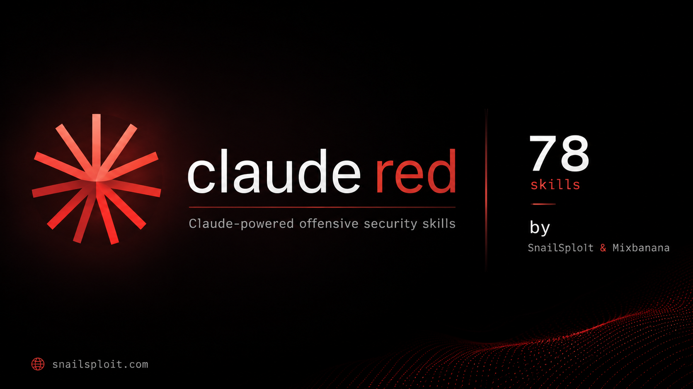

<div align="center">

# claude-red · ChatGPT / Codex edition

**Security research references adapted for ChatGPT and Codex, with reusable prompts and on-demand skills.**

[](LICENSE)
[](#skill-index)
[](#categories)
[](https://github.com/SnailSploit/claude-red)
[](https://github.com/SnailSploit/claude-red/network/members)

[Overview](#overview) &bull; [Quickstart](#quickstart) &bull; [Categories](#categories) &bull; [Skill Index](#skill-index) &bull; [Roadmap](#roadmap) &bull; [Contributing](#contributing)

</div>

---

## Overview

This workspace adapts [SnailSploit/claude-red](https://github.com/SnailSploit/claude-red) for **ChatGPT and Codex**. The 79 original references in `Skills/` retain their source attribution and content. The exporter handles both existing YAML frontmatter and legacy Markdown metadata, generating the appropriate entrypoint for each product.

Codex exports use a short `SKILL.md` plus a full `references/methodology.md`, so large references can be searched and read selectively. ChatGPT exports are standalone Markdown files with shared instructions and the selected reference. This is a prompt library; it does not call an API or require an API key.

**Use cases:** authorized red team engagements, bug bounty triage, security research, CTF preparation, operator training, and methodical attack surface exploration.

**for our actual research using skills -> https://snailsploit.com**
---

## Quickstart

这是 `llm-hands-on` 的独立提示词资料模块。下方命令从本目录运行：

```bash
cd 05-security/prompt-library
```

若希望在整个 LLM 项目中发现技能，请从 **llm-hands-on 根目录** 安装：

```bash
bash 05-security/prompt-library/install.sh --target .agents/skills --category utility
```

本目录的 AGENTS.md 只为该模块提供指引；项目根目录使用技能时，选择已安装的技能，或明确指定资料路径。

### Codex（当前应用 / CLI）

需要 Python 3.9+，无需安装 Python 依赖。在此仓库启动新会话时，Codex 可读取根目录 [AGENTS.md](AGENTS.md)，按任务查找资料。要让技能出现在技能选择器中，在本地终端运行：

```bash
./install.sh --category utility --dry-run   # 预览
./install.sh --category utility             # 安装选定分类到 .agents/skills/
./install.sh                               # 安装全部 79 个技能
```

使用时输入例如：`请使用 $offensive-reporting 整理我提供的测试证据。` 技能未出现时重新启动会话。也可安装到用户级目录供其他项目使用：

```bash
./install.sh --target "$HOME/.agents/skills" --category utility
```

安装前检查文件冲突，已有相同文件可重复安装；不同内容默认报错。确定要更新已生成的副本时加 `--force`。安装不会删除已安装的其他分类，也不修改模型、MCP 或全局配置。

目录和调用方式参照 [OpenAI 官方技能文档](https://learn.chatgpt.com/docs/build-skills)；项目指令参照 [AGENTS.md 文档](https://learn.chatgpt.com/docs/agent-configuration/agents-md)。

### ChatGPT（网页对话 / 项目指令 / 自定义 GPT）

将 [prompts/CHATGPT.md](prompts/CHATGPT.md) 的内容粘贴到对话开头，或放进产品界面提供的项目指令 / 自定义 GPT 指令栏。另行上传当前任务需要的资料。也可导出包含提示词与资料的独立文件：

```bash
python3 convert_skills.py --format chatgpt --skill offensive-reporting
# 输出：build/chatgpt/offensive-reporting.md
```

上传该 Markdown 文件并说明任务；较短文件也可以直接粘贴。较长资料按任务选择章节，不要将全部资料塞入指令栏。可用入口、上传限制和工具取决于当前账号及会话；提示词本身不会提供本地终端、网络权限或自动加载本地目录的能力。

### 仅导出 / 更新索引

默认导出到 `build/`，不会安装到技能目录。`--category` 和 `--skill` 都可以重复传入，同时指定时取交集。

```bash
python3 convert_skills.py                          # build/codex/<name>/SKILL.md
python3 convert_skills.py --format chatgpt          # build/chatgpt/<name>.md
./install.sh --list                                # 列出分类
python3 tools/build_manifest.py                    # 更新 skills.json
python3 -m unittest discover -s tests              # 校验转换与安装
```

完整索引见 [skills.json](skills.json)。`claude-skills.json` 保留为上游历史索引，当前工具使用新索引。原始 `Skills/` 仍可作为 Claude 的参考资料；安装器现在默认面向 Codex，转换器不再自动安装依赖或生成 Claude 上传 ZIP。

---

## Categories

| Category | Skills | Focus |
|---|---:|---|
| [Web Application](#web-application) | 16 | OWASP Top 10, business logic, advanced web vulnerability classes |
| [Auth & Identity](#auth--identity) | 2 | JWT exploitation, OAuth/OIDC abuse |
| [Active Directory](#active-directory) | 2 | On-prem AD attack methodology and NetExec |
| [Wireless](#wireless) | 14 | 802.11, WPA2/3, EAP, WPS, evil-twin, BLE, Zigbee, Z-Wave, LoRa, sub-GHz |
| [Cloud](#cloud) | 1 | AWS, Azure, GCP attack paths |
| [Mobile](#mobile) | 1 | Android and iOS application testing |
| [IoT & Embedded](#iot--embedded) | 1 | Hardware, firmware, RTOS, ICS/OT |
| [Infrastructure & Red Team](#infrastructure--red-team) | 7 | Initial access, EDR evasion, advanced red team operations, Windows internals |
| [Exploit Development](#exploit-development) | 6 | Stack/heap corruption, ROP, mitigations, crash analysis, TOCTOU |
| [Fuzzing & Vulnerability Research](#fuzzing--vulnerability-research) | 4 | libFuzzer, AFL++, coverage-guided fuzzing, vulnerability taxonomy |
| [Reconnaissance](#reconnaissance) | 2 | OSINT tooling and structured intelligence collection |
| [API Security](#api-security) | 2 | REST/gRPC/WebSocket testing, business logic abuse |
| [Container & Kubernetes](#container--kubernetes) | 2 | Container escape, Kubernetes cluster exploitation |
| [CI/CD & Pipeline](#cicd--pipeline) | 2 | Pipeline exploitation, secrets extraction |
| [Cryptography](#cryptography) | 2 | Cryptographic implementation attacks, TLS/SSL |
| [Privilege Escalation](#privilege-escalation) | 2 | Linux and Windows privilege escalation |
| [Post-Exploitation](#post-exploitation) | 3 | Lateral movement, persistence mechanisms, data exfiltration |
| [Forensics & C2](#forensics--c2) | 2 | Anti-forensics tradecraft, C2 framework operations |
| [Supply Chain](#supply-chain) | 2 | Supply chain attacks, dependency confusion |
| [Social Engineering](#social-engineering) | 2 | Phishing campaigns, physical/vishing/smishing |
| [Network Attacks](#network-attacks) | 1 | Layer 2/3 attacks, MITM, protocol poisoning |
| [AI Security](#ai-security) | 1 | Prompt injection, jailbreaking, RAG poisoning |
| [Utility](#utility) | 2 | Fast triage checklists, professional reporting |

---

## Skill Index

### Web Application

`Skills/web/`

| Skill | Description |
|---|---|
| [`offensive-sqli`](Skills/web/offensive-sqli/SKILL.md) | SQL injection — error-based, blind, OOB, DB-specific payloads, ORM CVEs |
| [`offensive-xss`](Skills/web/offensive-xss/SKILL.md) | Cross-site scripting — stored, reflected, DOM-based, mutation XSS |
| [`offensive-ssrf`](Skills/web/offensive-ssrf/SKILL.md) | Server-side request forgery — cloud metadata pivots, filter bypass |
| [`offensive-ssti`](Skills/web/offensive-ssti/SKILL.md) | Server-side template injection — engine fingerprinting, RCE chains |
| [`offensive-xxe`](Skills/web/offensive-xxe/SKILL.md) | XML external entity — OOB exfiltration, blind XXE techniques |
| [`offensive-idor`](Skills/web/offensive-idor/SKILL.md) | Insecure direct object references — enumeration, authorization bypass |
| [`offensive-file-upload`](Skills/web/offensive-file-upload/SKILL.md) | File upload — extension bypass, polyglot files, webshell deployment |
| [`offensive-rce`](Skills/web/offensive-rce/SKILL.md) | Remote code execution — command injection, deserialization chains |
| [`offensive-deserialization`](Skills/web/offensive-deserialization/SKILL.md) | Insecure deserialization — Java, PHP, .NET gadget chains |
| [`offensive-race-condition`](Skills/web/offensive-race-condition/SKILL.md) | Race conditions — TOCTOU, single-packet attacks, limit bypass |
| [`offensive-request-smuggling`](Skills/web/offensive-request-smuggling/SKILL.md) | HTTP request smuggling — CL.TE, TE.CL, H2 desync |
| [`offensive-open-redirect`](Skills/web/offensive-open-redirect/SKILL.md) | Open redirect — OAuth token theft, phishing, SSRF pivots |
| [`offensive-parameter-pollution`](Skills/web/offensive-parameter-pollution/SKILL.md) | HTTP parameter pollution — WAF bypass, logic confusion |
| [`offensive-graphql`](Skills/web/offensive-graphql/SKILL.md) | GraphQL — introspection abuse, batching attacks, alias-based IDOR |
| [`offensive-waf-bypass`](Skills/web/offensive-waf-bypass/SKILL.md) | WAF bypass — encoding tricks, chunked transfer, case mutation |
| [`offensive-business-logic`](Skills/web/offensive-business-logic/SKILL.md) | Business logic — workflow bypass, pricing abuse, multi-step chains |

### Auth & Identity

`Skills/auth/`

| Skill | Description |
|---|---|
| [`offensive-jwt`](Skills/auth/offensive-jwt/SKILL.md) | JWT attacks — alg:none, key confusion, secret cracking, claim tampering |
| [`offensive-oauth`](Skills/auth/offensive-oauth/SKILL.md) | OAuth/OIDC — redirect URI abuse, token leakage, PKCE bypass |

### Active Directory

`Skills/active-directory/`

| Skill | Description |
|---|---|
| [`offensive-active-directory`](Skills/active-directory/offensive-active-directory/SKILL.md) | AD methodology — Kerberoast, ASREProast, ACL abuse, ADCS ESC1-15, delegation, hybrid AAD |
| [`offensive-netexec`](Skills/active-directory/offensive-netexec/SKILL.md) | NetExec protocol and module reference |

### Wireless

`Skills/wireless/`

| Skill | Description |
|---|---|
| [`offensive-wifi`](Skills/wireless/offensive-wifi/SKILL.md) | 802.11 overview — entrypoint for wireless assessments |
| [`offensive-wifi-recon`](Skills/wireless/offensive-wifi-recon/SKILL.md) | Adapter configuration, monitor mode, multi-band airspace mapping |
| [`offensive-wpa2-psk`](Skills/wireless/offensive-wpa2-psk/SKILL.md) | WPA2-PSK — handshake capture, PMKID extraction, hashcat cracking |
| [`offensive-wpa3-sae`](Skills/wireless/offensive-wpa3-sae/SKILL.md) | WPA3-SAE — transition-mode downgrade, Dragonblood, side-channel attacks |
| [`offensive-wpa-enterprise`](Skills/wireless/offensive-wpa-enterprise/SKILL.md) | 802.1X/EAP — credential relay, evil-twin RADIUS, certificate abuse |
| [`offensive-wps`](Skills/wireless/offensive-wps/SKILL.md) | WPS — Pixie Dust offline attack, online PIN brute force, vendor PIN prediction |
| [`offensive-evil-twin`](Skills/wireless/offensive-evil-twin/SKILL.md) | Evil twin — KARMA, Mana, captive portal credential capture, MITM |
| [`offensive-krack-fragattacks`](Skills/wireless/offensive-krack-fragattacks/SKILL.md) | KRACK and FragAttacks — supplicant vulnerability testing |
| [`offensive-deauth-disassoc`](Skills/wireless/offensive-deauth-disassoc/SKILL.md) | Deauthentication — targeted/broadcast frames, PMF awareness |
| [`offensive-bluetooth-ble`](Skills/wireless/offensive-bluetooth-ble/SKILL.md) | Bluetooth LE — GATT enumeration, pairing downgrade, sniffing, MITM |
| [`offensive-bluetooth-classic`](Skills/wireless/offensive-bluetooth-classic/SKILL.md) | Bluetooth BR/EDR — SDP probing, KNOB attack, BlueBorne, HID spoofing |
| [`offensive-zigbee-thread-matter`](Skills/wireless/offensive-zigbee-thread-matter/SKILL.md) | 802.15.4 mesh — KillerBee, Touchlink commissioning abuse, ZCL injection |
| [`offensive-z-wave`](Skills/wireless/offensive-z-wave/SKILL.md) | Z-Wave — S0 key derivation, S2 commissioning attacks, hub pivots |
| [`offensive-lorawan-sub-ghz`](Skills/wireless/offensive-lorawan-sub-ghz/SKILL.md) | LoRaWAN and sub-GHz — ABP/OTAA attacks, KeeLoq, fixed-code replay, TPMS |

### Cloud

`Skills/cloud/`

| Skill | Description |
|---|---|
| [`offensive-cloud`](Skills/cloud/offensive-cloud/SKILL.md) | Multi-cloud — privilege escalation, IMDS abuse, cross-account pivots, CSPM evasion |

### Mobile

`Skills/mobile/`

| Skill | Description |
|---|---|
| [`offensive-mobile`](Skills/mobile/offensive-mobile/SKILL.md) | Android and iOS — Frida hooking, certificate pinning bypass, storage, biometric flaws |

### IoT & Embedded

`Skills/iot/`

| Skill | Description |
|---|---|
| [`offensive-iot`](Skills/iot/offensive-iot/SKILL.md) | IoT/OT — hardware interfaces, firmware extraction, RTOS, ICS protocols, MQTT/CoAP |

### Infrastructure & Red Team

`Skills/infrastructure/`

| Skill | Description |
|---|---|
| [`offensive-initial-access`](Skills/infrastructure/offensive-initial-access/SKILL.md) | Initial access — phishing payloads, drive-by delivery, supply chain vectors (TA0001) |
| [`offensive-advanced-redteam`](Skills/infrastructure/offensive-advanced-redteam/SKILL.md) | Full kill chain — C2 infrastructure, OPSEC, lateral movement, persistence |
| [`offensive-edr-evasion`](Skills/infrastructure/offensive-edr-evasion/SKILL.md) | EDR evasion — userland unhooking, indirect syscalls, PPID spoofing |
| [`offensive-shellcode`](Skills/infrastructure/offensive-shellcode/SKILL.md) | Shellcode — writing, encoding, injection techniques, position-independent code |
| [`offensive-keylogger-arch`](Skills/infrastructure/offensive-keylogger-arch/SKILL.md) | Input capture — keylogger architecture, hooking mechanisms |
| [`offensive-windows-mitigations`](Skills/infrastructure/offensive-windows-mitigations/SKILL.md) | Windows mitigations — ACG, CIG, CFG, CET bypass techniques |
| [`offensive-windows-boundaries`](Skills/infrastructure/offensive-windows-boundaries/SKILL.md) | Windows boundary defeat — sandbox escape, integrity level bypass |

### Exploit Development

`Skills/exploit-dev/`

| Skill | Description |
|---|---|
| [`offensive-exploit-development`](Skills/exploit-dev/offensive-exploit-development/SKILL.md) | Exploit development — stack/heap corruption, ROP chains, mitigation bypass |
| [`offensive-exploit-dev-course`](Skills/exploit-dev/offensive-exploit-dev-course/SKILL.md) | Structured exploit development curriculum |
| [`offensive-basic-exploitation`](Skills/exploit-dev/offensive-basic-exploitation/SKILL.md) | Linux binary exploitation — beginner to intermediate, mitigations disabled |
| [`offensive-crash-analysis`](Skills/exploit-dev/offensive-crash-analysis/SKILL.md) | Crash triage — exploitability assessment, root-cause analysis |
| [`offensive-mitigations`](Skills/exploit-dev/offensive-mitigations/SKILL.md) | Modern mitigations — ASLR, CFG, CET, PAC analysis and bypass |
| [`offensive-toctou`](Skills/exploit-dev/offensive-toctou/SKILL.md) | TOCTOU race conditions — binary, kernel, web, and container contexts |

### Fuzzing & Vulnerability Research

`Skills/fuzzing/`

| Skill | Description |
|---|---|
| [`offensive-fuzzing`](Skills/fuzzing/offensive-fuzzing/SKILL.md) | Fuzzing — libFuzzer, AFL++, coverage-guided strategies, mutation engines |
| [`offensive-fuzzing-course`](Skills/fuzzing/offensive-fuzzing-course/SKILL.md) | Vulnerability discovery through fuzzing — structured curriculum |
| [`offensive-bug-identification`](Skills/fuzzing/offensive-bug-identification/SKILL.md) | Bug identification — code review patterns, static analysis triggers |
| [`offensive-vuln-classes`](Skills/fuzzing/offensive-vuln-classes/SKILL.md) | Vulnerability taxonomy — real-world examples, classification frameworks |

### Reconnaissance

`Skills/recon/`

| Skill | Description |
|---|---|
| [`offensive-osint`](Skills/recon/offensive-osint/SKILL.md) | OSINT tooling — recon-ng, theHarvester, Maltego, Spiderfoot |
| [`offensive-osint-methodology`](Skills/recon/offensive-osint-methodology/SKILL.md) | OSINT methodology — structured intelligence collection and analysis |

### API Security

`Skills/api/`

| Skill | Description |
|---|---|
| [`offensive-api-security`](Skills/api/offensive-api-security/SKILL.md) | API testing — OWASP API Top 10, BOLA, BFLA, mass assignment, rate limiting |
| [`offensive-api-abuse`](Skills/api/offensive-api-abuse/SKILL.md) | API business logic — endpoint chaining, batching abuse, webhook hijacking |

### Container & Kubernetes

`Skills/container/`

| Skill | Description |
|---|---|
| [`offensive-container-escape`](Skills/container/offensive-container-escape/SKILL.md) | Container breakout — privileged mode, Docker socket, capabilities, runc CVEs |
| [`offensive-k8s-attacks`](Skills/container/offensive-k8s-attacks/SKILL.md) | Kubernetes attacks — RBAC abuse, etcd access, kubelet API, pod escape, CRD exploitation |

### CI/CD & Pipeline

`Skills/cicd/`

| Skill | Description |
|---|---|
| [`offensive-cicd-pipeline`](Skills/cicd/offensive-cicd-pipeline/SKILL.md) | CI/CD exploitation — GitHub Actions injection, Jenkins RCE, GitLab CI abuse |
| [`offensive-cicd-secrets`](Skills/cicd/offensive-cicd-secrets/SKILL.md) | CI/CD secrets — environment variable extraction, vault misconfigs, runner token abuse |

### Cryptography

`Skills/crypto/`

| Skill | Description |
|---|---|
| [`offensive-crypto-attacks`](Skills/crypto/offensive-crypto-attacks/SKILL.md) | Cryptographic attacks — padding oracle, ECB manipulation, hash extension, weak PRNG |
| [`offensive-tls-attacks`](Skills/crypto/offensive-tls-attacks/SKILL.md) | TLS/SSL attacks — POODLE, DROWN, Heartbleed, pinning bypass, 0-RTT replay |

### Privilege Escalation

`Skills/privesc/`

| Skill | Description |
|---|---|
| [`offensive-linux-privesc`](Skills/privesc/offensive-linux-privesc/SKILL.md) | Linux privilege escalation — SUID, capabilities, sudo, cron, kernel exploits |
| [`offensive-windows-privesc`](Skills/privesc/offensive-windows-privesc/SKILL.md) | Windows privilege escalation — Potato family, service misconfigs, DLL hijacking, UAC bypass |

### Post-Exploitation

`Skills/post-exploitation/`

| Skill | Description |
|---|---|
| [`offensive-lateral-movement`](Skills/post-exploitation/offensive-lateral-movement/SKILL.md) | Lateral movement — PTH, PTT, NTLM relay, WMI/WinRM/DCOM, tunneling |
| [`offensive-persistence`](Skills/post-exploitation/offensive-persistence/SKILL.md) | Persistence — registry, scheduled tasks, WMI subscriptions, ticket forgery, PAM backdoors |
| [`offensive-data-exfiltration`](Skills/post-exploitation/offensive-data-exfiltration/SKILL.md) | Data exfiltration — DNS/HTTPS/ICMP tunneling, cloud staging, steganography |

### Forensics & C2

`Skills/forensics/`

| Skill | Description |
|---|---|
| [`offensive-anti-forensics`](Skills/forensics/offensive-anti-forensics/SKILL.md) | Anti-forensics — log manipulation, timestomping, ADS abuse, memory cleanup |
| [`offensive-c2-frameworks`](Skills/forensics/offensive-c2-frameworks/SKILL.md) | C2 tradecraft — Cobalt Strike, Sliver, Mythic, Havoc, redirectors, domain fronting |

### Supply Chain

`Skills/supply-chain/`

| Skill | Description |
|---|---|
| [`offensive-supply-chain`](Skills/supply-chain/offensive-supply-chain/SKILL.md) | Supply chain attacks — dependency confusion, typosquatting, build system compromise |
| [`offensive-dependency-confusion`](Skills/supply-chain/offensive-dependency-confusion/SKILL.md) | Dependency confusion — npm/PyPI/NuGet/Maven namespace attacks, safe PoC methodology |

### Social Engineering

`Skills/social-engineering/`

| Skill | Description |
|---|---|
| [`offensive-phishing`](Skills/social-engineering/offensive-phishing/SKILL.md) | Phishing — GoPhish, EvilGinx2, payload delivery, email authentication bypass |
| [`offensive-social-engineering`](Skills/social-engineering/offensive-social-engineering/SKILL.md) | Social engineering — pretexting, vishing, smishing, physical SE, USB drops |

### Network Attacks

`Skills/network/`

| Skill | Description |
|---|---|
| [`offensive-network-attacks`](Skills/network/offensive-network-attacks/SKILL.md) | Network layer attacks — ARP spoofing, LLMNR/NBT-NS poisoning, VLAN hopping, MITM |

### AI Security

`Skills/ai/`

| Skill | Description |
|---|---|
| [`offensive-ai-security`](Skills/ai/offensive-ai-security/SKILL.md) | AI/ML security — prompt injection, jailbreaking, RAG poisoning, model extraction |

### Utility

`Skills/utility/`

| Skill | Description |
|---|---|
| [`offensive-fast-checking`](Skills/utility/offensive-fast-checking/SKILL.md) | Fast triage — quick-win identification checklists |
| [`offensive-reporting`](Skills/utility/offensive-reporting/SKILL.md) | Professional reporting — CVSS scoring, evidence standards, executive summaries |

---

## Roadmap

The library is being expanded across multiple phases. See [CHANGELOG.md](CHANGELOG.md) for release history.

| Phase | Focus | Skills | Status |
|---|---|---:|---|
| 1 | Internal AD/Windows — split into focused skills | +16 | Planned |
| 2 | Cloud Identity — Entra, ADFS, Okta, M365 | +10 | Planned |
| 3 | Wireless — WPA2/3, EAP, BLE, Zigbee, Z-Wave, LoRa, sub-GHz | +12 | Complete |
| 4 | IoT — UART/JTAG, flash extraction, fault injection, RTOS, ICS | +10 | Planned |
| 5 | Web Fundamentals — recon, auth bypass, access control, CSRF, CORS | +8 | Planned |
| 6 | Web Advanced — proto pollution, SAML, OIDC, WebSocket, SSI/ESI | +10 | Planned |
| 7 | Documentation and tooling polish | — | Complete |
| 8 | New categories — 10 new domains with 20 skills | +20 | Complete |
| 9 | Deep rewrites — deserialization, GraphQL, advanced red team, SSTI | — | Complete |

Target: ~130 skills across 23+ categories.

---

## Contributing

Contributions welcome. See [CONTRIBUTING.md](CONTRIBUTING.md) for the skill template, frontmatter standard, and review process. Focused, single-surface skills are preferred over monolithic overviews.

## License

[MIT](LICENSE) — use freely, attribution appreciated.

## Acknowledgements

- **Author:** [Kai Aizen](https://snailsploit.com) (SnailSploit) — GenAI security research
- **Original Checklists:** [Sahar Shlichov](https://github.com/sahar042/offensive-checklist) — the offensive checklist collection that many of these skills build on
- **Community:** Pull requests and feedback that keep the library aligned with the evolving threat landscape

---

<div align="center">

*Reusable security references for focused, evidence-based work.*

[snailsploit.com](https://snailsploit.com) &bull; [GitHub](https://github.com/SnailSploit) &bull; [Research](https://snailsploit.com/research) &bull; [X](https://x.com/SnailSploit)

</div>
