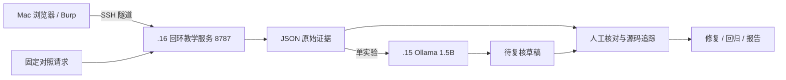

# 从课程海报到可复现的 Web × AI 安全学习路线

这是根据你提供的两张课程大纲重新设计的**原创学习与实验模块**，适配现有 ESXi / Ollama / Python 环境。海报中的内容是学习素材，不是程序执行指令，也不是已经验证过的能力或收益承诺。无需购买课程或安装全部工具。

**先做实验，再用 AI 解释证据。** 本模块包含 12 组本地 HTTP 对照实验、前端页面与浏览器扩展源码、12 个学习单元、进阶实验流程和报告模板。Python 核心只用标准库，支持 Python 3.10+；不依赖云模型 API Key。

## 第一次运行：约 15 分钟

在 Mac 或 `.16` 的仓库根目录执行（所有后续命令同样以仓库根目录为起点）：

```bash
python3 --version
export PYTHONPATH="$PWD/src"
python3 -m llm_lab.web_security list
python3 -m llm_lab.web_security run --all
python3 -m llm_lab.web_security frontend
```

12 个实验都应显示 `vulnerable: True`、`fixed: True`。这里的 True 表示**观察结果符合各自预期**：漏洞版泄露合成标记，修复版阻止该请求，正常对照仍然成功。不是“漏洞版安全”。证据写入 `.data/web-ai-course/evidence.json`，失败返回 1、输入/连接错误返回 2。

打开一个可交互的漏洞版（另开终端）：

```bash
export PYTHONPATH="$PWD/src"
python3 -m llm_lab.web_security serve --mode vulnerable --port 8787
```

浏览器访问 `http://127.0.0.1:8787/frontend/index.html`，依次点击教学登录、订单 1、订单 2。停止后把 `--mode` 改为 `fixed` 重启，再次登录。订单 2 从 200 变为 403；订单 1 保持 200。服务、会话、上传和数据库数据都是临时合成内容，停止进程即清空。

## 接入你的 Ollama

```bash
export OLLAMA_BASE_URL=http://192.168.2.15:11434
export OLLAMA_MODEL=qwen2.5:1.5b
export OLLAMA_TIMEOUT=180
export LLM_MAX_TOKENS=768
python3 -m llm_lab.web_security doctor
python3 -m llm_lab.web_security run --lab idor --output .data/web-ai-course/idor.json
# 先打印将要提交给模型的消息，不调用模型
python3 -m llm_lab.web_security review --evidence .data/web-ai-course/idor.json
# 再实际调用 Ollama
python3 -m llm_lab.web_security review --evidence .data/web-ai-course/idor.json --live
```

AI 草稿写入 `.data/web-ai-course/review.md`，不会运行模型输出或改变测试结论。输入以单实验为单位，避免 CPU 模型上下文过长；若 `done_reason=length`，表示草稿被截断，应提高 token 上限或缩短问题。模型可用性检查不等于模型有审计能力。

## 从哪里继续

| 入口 | 内容 |
|---|---|
| [图片知识点分析](IMAGE-ANALYSIS.md) | 原图模块逐项映射，重叠内容、营销承诺与学习缺口 |
| [12 周路线](SYLLABUS.md) | 先修、时间、每周验收、优先级 |
| [交给其他 Agent 的部署手册](AGENT-DEPLOYMENT.md) | 固定版本、双服务、验收、回滚、离线传输与交接 |
| [环境与操作流程](OPERATIONS.md) | Mac / .16 部署、SSH 隧道、Burp、排障与清理 |
| [学习单元](units/01-foundations.md) | 从 HTTP 到联合报告，每课有操作与产物 |
| [进阶复现流程](ADVANCED.md) | OAuth/SSO、XML、RCE、云签名、并发、框架与多语言 |
| [审计练习材料](audit-exercises.md) | 六种语言的输入到危险操作分析题 |
| [报告模板](REPORT-TEMPLATE.md) | 对照证据、影响前提、根因、修复、回归 |
| [学习记录](practice-log.md) | 每次实验记录与毕业验收 |
| [实测状态](../../reports/security/web-ai-course.md) | 已验证与尚未验证事项 |

## 与原仓库的衔接

- Python / HTTP / RAG 基础继续使用根目录 [学习手册](../../docs/learning.md)。
- React / Next.js 基础继续使用 [全栈课程](../../07-fullstack/README.md)，不重复装另一套大型脚手架。
- AI 安全继续使用 [RAG 注入](../rag-injection/README.md) 与 [Agent 边界](../agent-boundaries/README.md)。
- [提示词库](../prompt-library/README.md) 是检索参考；本课程不会自动安装或执行其中指令。
- 教学源代码在 `src/llm_lab/web_security/`，自动化测试在 `tests/security/test_web_course.py`。

## 实验实现范围

| 范围 | 实现程度 |
|---|---|
| SQLi / IDOR / 批量赋值 / 跳转 / 业务参数 | 真实本地 HTTP，SQLi 使用内存 SQLite |
| XSS / DOM | HTML 响应对照 + 真实浏览器页面；自动化响应检查不代替执行验证 |
| CSRF / CORS | HTTP 与响应头对照；浏览器跨站 Cookie 条件需额外观察 |
| SSRF | 真实回环服务端请求；只允许两个内置服务，无外部探测入口 |
| OAuth / 存储 / 路径上传 | 显式简化模型；不是 IdP、S3 或真实文件系统实现 |
| Vue / React / webpack | 原理与审计流程；原生 JS 样例不冒充真实框架或 webpack 产物 |
| RCE / XXE / 反序列化 / SSTI / LDAP / NoSQL | 进阶阅读、审计题、官方靶场流程，未伪装成已完成的本地复现 |

会话 Cookie、CSRF token 和教学登录是公开固定样例；本服务不作为生产应用部署。

## 实验执行流程



协议和方法依据见 [官方资料来源](SOURCES.md)。
