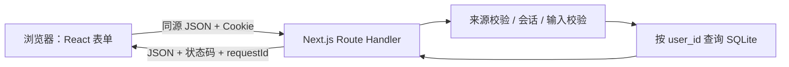

# 全栈工程路线：从页面到可运行的学习看板

把 16 个阶段串成一条交付路线：**读懂请求 → 做出页面 → 保存数据 → 区分用户 → 测试 → 部署 → 观察运行状态**。
每个单元都有对应代码、动手任务和验收证据。不必学完所有框架再开始做项目。

## 先运行，再按阶段拆解

完整项目在 [taskboard](taskboard/README.md)：Next.js + React + TypeScript + Node.js + SQLite。
具备注册 / 登录 / 退出、个人任务增删改、16 阶段筛选、完成进度和响应式界面。
它不连接模型、不需要 API key，也不依赖 Redis、MongoDB 或外部数据库。

```bash
cd 07-fullstack/taskboard
npm ci
npm run dev
```

需要 **Node.js 24 LTS**，浏览器访问 **http://127.0.0.1:3000**，自行注册学习账号。
首次安装需要网络；依赖版本由 package-lock.json 锁定。数据库在首次 API 请求时自动初始化。

尚未接触 React 时，从 [原生 HTML / CSS / JavaScript 练习](foundations/README.md) 开始。

## 16 个单元

| 阶段 | 单元 | 要交付的东西 |
|---|---|---|
| 1 | [HTML + CSS](units/01-html-css.md) | 可用键盘操作、结构清楚的任务页面 |
| 2 | [JavaScript](units/02-javascript.md) | 事件、状态、localStorage 和错误提示 |
| 3 | [Git + GitHub](units/03-git-github.md) | 一个有变更说明和测试证据的练习 PR |
| 4 | [TypeScript](units/04-typescript.md) | 类型检查与运行时校验各一条证据 |
| 5 | [React](units/05-react.md) | 状态驱动的增删改与派生统计 |
| 6 | [Next.js](units/06-nextjs.md) | 页面、客户端组件和服务端 API 的边界图 |
| 7 | [响应式设计 + UI](units/07-responsive-ui.md) | 手机和桌面截图、键盘导航检查 |
| 8 | [APIs + REST](units/08-api-rest.md) | 一组正常及异常请求 / 响应 |
| 9 | [后端：Node.js / Python](units/09-backend.md) | 路由到业务逻辑到数据库的调用链 |
| 10 | [数据库：SQL + NoSQL](units/10-databases.md) | 表关系、索引、持久化与选型记录 |
| 11 | [身份验证 + 授权](units/11-auth.md) | 双账号隔离、退出和会话过期的证据 |
| 12 | [单元 + 集成 + E2E 测试](units/12-testing.md) | 本地与 CI 测试结果 |
| 13 | [Docker](units/13-docker.md) | 一条命令启动、重启后数据仍存在 |
| 14 | [系统设计](units/14-system-design.md) | 一页架构决策记录 |
| 15 | [构建真实项目](units/15-real-project.md) | 一项完整的可验收功能变更 |
| 16 | [部署 + 监控 + 扩展](units/16-deploy-observe-scale.md) | 发布记录、健康检查、备份和恢复演练 |

建议按 **1–3 / 4–7 / 8–11 / 12–16** 四段推进。每段完成后再进入下一段，学习时长由验收情况决定。
已有基础时，可以先完成项目的快速复现，再挑不熟悉的单元补齐。

## 一次任务贯穿整个系统



SQLite 是 SQL 数据库；本项目的 localStorage 和 JSON 文件不等于“已经学习了 MongoDB”。
NoSQL、独立 Python 后端和分布式部署作为有明确验收目标的扩展练习，避免把初始项目堆成多个服务。
Node.js 后端在本项目中实际运行；Python/FastAPI 对照已有 [工程化单元](../04-engineering/README.md)。

## 与原有 LLM 路线连接

先完成这个项目的账号、数据和测试闭环，再为用户增加“根据学习记录生成复习建议”：
浏览器调用自己的服务端，服务端再调用原有 `llm-lab` API。模型地址和密钥只留在服务端。
为上游超时、模型不可用和不可信输出分别写测试；具体任务见阶段 15。

将每个阶段的结果写入 [学习验收记录](practice-log.md)，记录命令、实际输出、截图或提交链接。
运行过测试不代表完成了公网服务的容量、可用性或安全评估。
