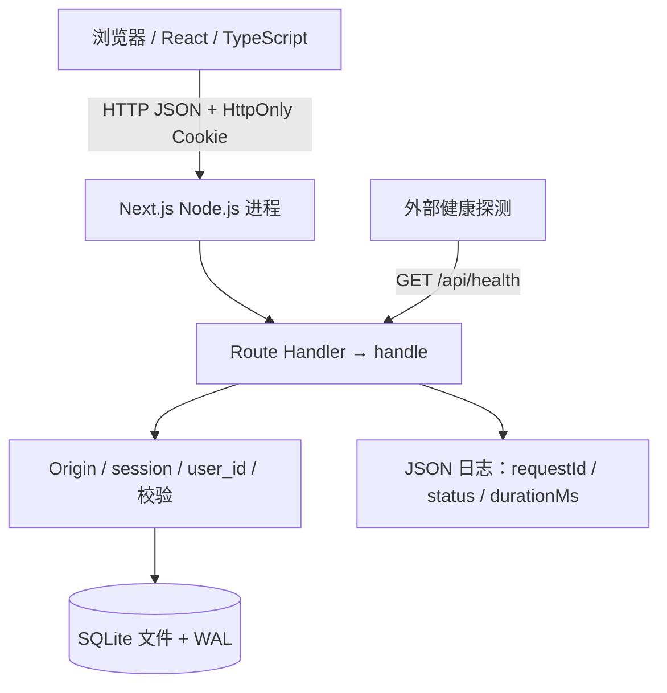
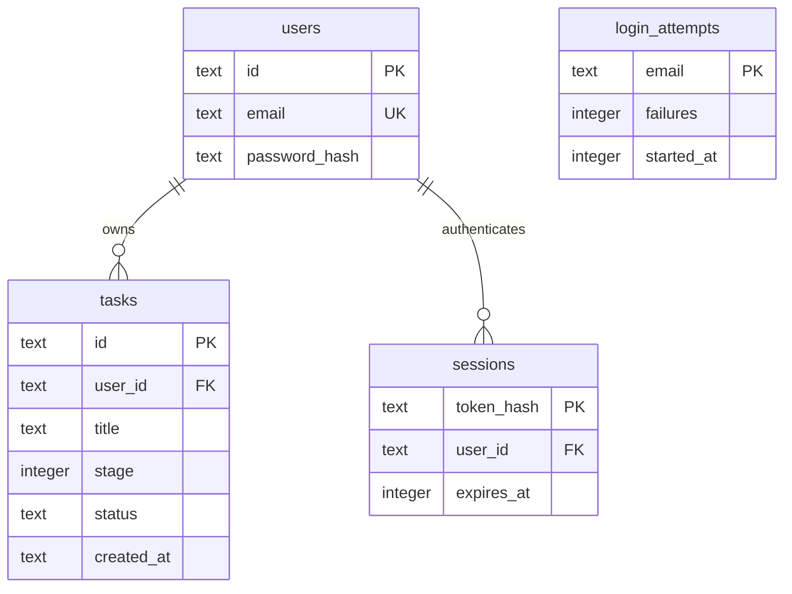

# 架构与设计取舍

## 运行边界

浏览器只导入 domain.ts 中的类型和纯逻辑。node:sqlite、node:crypto、密码与会话只存在服务端。
认证依赖服务端数据库，服务端不接受浏览器传入的所有者身份。

## 数据关系

schema 版本由 PRAGMA user_version 管理；初始建表在事务中完成。每个 SQL 值都用参数绑定，
数据库层同时保留 UNIQUE、CHECK、外键约束。当前任务查询有所有者索引。

## 为什么用这个组合

| 选择                       | 收益                                      | 限制与下一步                                |
| -------------------------- | ----------------------------------------- | ------------------------------------------- |
| Next.js 同时提供 UI 与 API | 一条命令启动，同源 Cookie，无需先处理跨域 | 拆出 Python 服务时必须定义协议、超时与鉴权  |
| Node 内置 SQLite           | 不需要数据库服务或本机编译数据库驱动      | 同步连接与单机文件限制吞吐和多实例部署      |
| 随机会话 token             | 可以撤销与过期，Cookie 不存业务数据       | 需要持久的共享会话存储才能多实例运行        |
| 手写少量边界校验           | 看得懂 unknown 到有效数据的过程           | 字段和 API 增多后可采用 schema 工具生成契约 |
| React 本地状态 + fetch     | 易观察完整请求过程                        | 列表很大或交互复杂后需要分页与请求缓存策略  |
| 本地 CSS 与系统字体        | 无额外样式库、CDN 或字体服务              | 后续可抽象组件和设计变量                    |

## 已实现与未实现

已实现：个人数据隔离、7 天会话、退出撤销、scrypt 哈希、按账号的失败计数、同源写请求校验、
JSON 请求体上限、参数化 SQL、错误状态、SQLite 在线备份脚本、健康接口和请求日志。

未实现：邮箱验证、密码重置、MFA、全局流量限制、独立权限角色、审计查询、分页、离线同步、
多实例限流协调、实时更新、指标平台与告警、自动扩缩容。这些属于后续业务需求，不是当前承诺。
按账号失败计数只是基础练习，不代替入口级并发控制或完整抗暴力登录方案。

## 从单机走向多实例的决策顺序

1. 测量响应体大小、查询耗时、5xx、请求延迟和磁盘占用；先为列表加分页。
2. 确认瓶颈后迁移 PostgreSQL，使用明确的 schema 迁移和共享会话 / 限流状态。
3. 将需要长时间处理的 LLM 任务放入有超时与重试边界的任务队列。
4. 最后再加负载均衡、多个应用实例和外部监控。不要把同一个 SQLite 文件挂到多机网络文件系统上冒充数据库集群。

为每一步记录目标、代价、回滚方式和观测证据。本项目没有对并发容量做生产基准测试。
