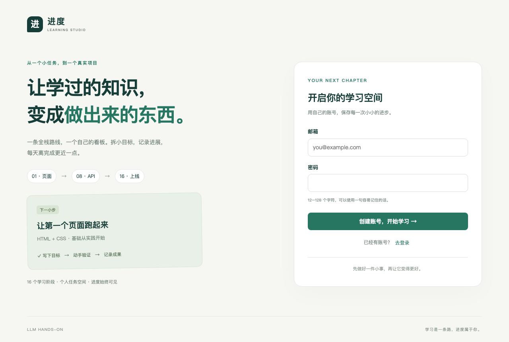

# 进度：最小可复现全栈项目

**React 页面 → 同源 REST API → Cookie 会话 → 按用户隔离的 SQLite 数据。**

功能：注册、登录、退出；任务创建 / 编辑 / 状态修改 / 删除；按 16 个学习阶段筛选；
完成比例；手机与桌面布局；数据库持久化；单元 / API 集成 / 浏览器 E2E 测试。
无模型调用、无默认账号、无付费服务、无外部字体下载。



## 1. 最短启动路径

安装 Node.js **24 LTS**（项目 .nvmrc 指定主版本），从仓库根目录运行：

```bash
cd 07-fullstack/taskboard
npm ci
npm run dev
```

打开 **http://127.0.0.1:3000**，用自己的邮箱和 12–128 字符密码注册。这里的邮箱是账号标识，
不会发送邮件。首次请求会创建 `.data/taskboard.sqlite`，刷新或重启后数据保留。

用两分钟验收：注册 → 新建任务 → 编辑标题和阶段 → 标记完成 → 刷新 → 退出并重新登录 → 删除任务。
再开一个无痕窗口注册另一账号，确认它看不到第一账号的任务。

无需复制环境文件即可运行。要自定义时：

```bash
cp .env.example .env.local
```

| 设置          | 默认值                 | 作用                                                     |
| ------------- | ---------------------- | -------------------------------------------------------- |
| APP_ORIGIN    | http://127.0.0.1:3000  | 浏览器的准确访问来源，用于写请求来源校验与 Secure Cookie |
| DATABASE_PATH | .data/taskboard.sqlite | 数据库文件位置                                           |
| PORT          | 3000                   | 正式启动脚本监听的端口                                   |
| BIND_HOST     | 127.0.0.1              | 正式启动脚本监听地址                                     |

不要混用 localhost 与 127.0.0.1。更换端口时同时修改 APP_ORIGIN；例如
`PORT=3001 APP_ORIGIN=http://127.0.0.1:3001 npm run start`。
开发端口可用 `APP_ORIGIN=http://127.0.0.1:3001 npm run dev -- --port 3001`。

## 2. 正式构建与 Docker

```bash
npm run build
npm run start
```

启动脚本运行 Next.js standalone 产物，并复制所需静态文件；数据库路径固定到项目目录。
也可以仅安装 Docker 与 Compose 插件后运行：

```bash
docker compose up --build -d --wait
docker compose logs --tail=30 app
```

同样访问 http://127.0.0.1:3000 。数据保存在 `taskboard-data` 命名卷，
`docker compose down` 会停止服务并保留卷。`docker compose down -v` **会删除卷中的账号和任务**。
本地 SQLite 与 Docker 卷是两个独立数据库。

Compose 读取 shell 变量或 `.env`，不会读取 Next.js 的 `.env.local`。
修改 Docker 端口示例：

```bash
APP_PORT=3001 APP_ORIGIN=http://127.0.0.1:3001 docker compose up --build -d --wait
```

## 3. 验证

```bash
npm run typecheck
npm test
npm run build
npx playwright install chromium
npm run test:e2e
```

E2E 自动启动 3100 端口的正式构建，使用独立数据库与随机测试账号，不连接开发数据库。
请先停止占用 3100 的进程。Linux 首次安装浏览器可用 `npx playwright install --with-deps chromium`。
测试覆盖与实际结果见 [验证记录](VALIDATION.md)。

应用已启动时，可运行真实 HTTP 冒烟检查：

```bash
node scripts/smoke.mjs
```

它在当前应用创建随机测试账号和任务，完成后清理任务并退出会话；测试账号保留。
不要把这些测试账号当成业务账号。

## 4. 从哪里读代码

| 文件                         | 学习内容                                         |
| ---------------------------- | ------------------------------------------------ |
| app/page.tsx、app/layout.tsx | 页面入口、语言、元数据                           |
| components/board.tsx         | React 状态、表单、异步请求、错误 / 加载状态      |
| app/globals.css              | Grid、断点、焦点、移动端布局                     |
| app/api/[...path]/route.ts   | Node.js Route Handler，转发到可测试的处理函数    |
| lib/domain.ts                | 共享类型、运行时校验、16 阶段与进度计算          |
| lib/api.ts                   | HTTP 路由、状态码、所有权校验与结构化日志        |
| lib/auth.ts                  | scrypt 密码哈希、随机会话、Cookie 与登录失败预算 |
| lib/db.ts                    | SQLite、参数化 SQL、索引、事务和 schema version  |
| tests/、e2e/                 | 纯函数、真实数据库 API 和真实浏览器测试          |
| Dockerfile、compose.yaml     | 多阶段构建、非 root 用户、健康检查和持久卷       |

完整 [API 契约](API.md)、[架构与取舍](ARCHITECTURE.md)、[运行与恢复](OPERATIONS.md)。

## 5. 教学项目的边界

这是一个单实例、少量用户的教学项目。它实现密码哈希、服务端会话、按用户查询和来源校验，
没有邮箱验证、忘记密码、MFA、账号管理、全局入口限流、审计平台或多实例协调。
登录限流按账号计数；对公共服务，应采用成熟身份系统和入口限流，并设计恢复、备份与权限流程。
SQLite 适合此单机练习；持久文件不能直接放到无持久磁盘的 Serverless 环境。

依赖的直接版本和传递依赖锁定在 package.json / package-lock.json。
Docker 的 Node 24 标签跟随补丁更新；需要逐字节构建复现时另外固定镜像 digest。

实现方式参考 [Next.js Route Handlers](https://nextjs.org/docs/app/getting-started/route-handlers)、
[Node.js SQLite](https://nodejs.org/download/release/latest-v24.x/docs/api/sqlite.html)、
[Docker Next.js 指南](https://docs.docker.com/guides/nextjs/) 和
[Playwright Web server](https://playwright.dev/docs/test-webserver)。
